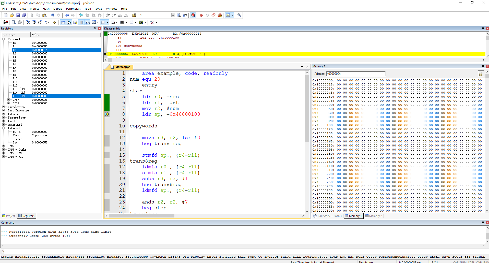
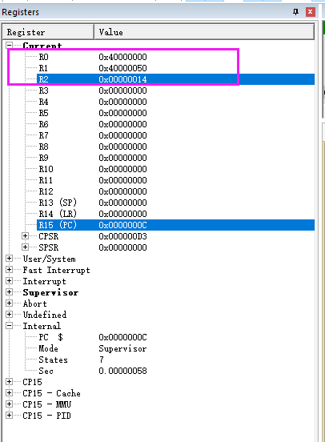
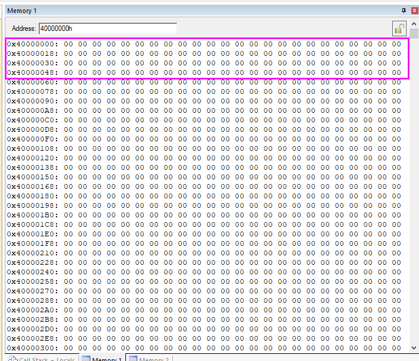

# 关于数据复制中的问题
## 1.代码
```ARM
	area example, code, readonly
num equ 20
	entry
start
	ldr r0, =src
	ldr r1, =dst
	mov r2, #num
	ldr sp, =0x40000100
	
copywords
	
	movs r3, r2, lsr #3
	beq trans1reg
		
	stmfd sp!, {r4-r11}
trans8reg
	ldmia r0!, {r4-r11}
	stmia r1!, {r4-r11}
	subs r3, r3, #1
	bne trans8reg
	ldmfd sp!, {r4-r11}
	
	ands r2, r2, #7
	beq stop
trans1reg
	ldr r4, [r0], #4
	str r4, [r1], #4
	subs r2, r2, #1
	bne trans1reg
	
stop
	mov r0, #0x18
	ldr r1, =0x20026
	swi 0x123456
		
	area mydata, data, readwrite
src & 1,2,3,4,5,6,7,0x8,1,2,3,4,5,6,7,8,1,2,3,4
dst & 0,0,0,0,0,0,0,0,0,0,0,0,0,0,0,0,0,0,0,0
	end
```

## 2. 问题描述
我在keil5中，使用其模拟调试功能调试上述代码。但发现keil的memory window显示的内存内容与代码中定义的不一致。百度无果。

<div align="center">

</div>

R0的初始地址为```0x40000000```，R1的初始地址为```0x40000050```。

<div align="center">

</div>

但memory window所显示的```0x40000000```地址处的内容全部为0。
<div align="center">

</div>