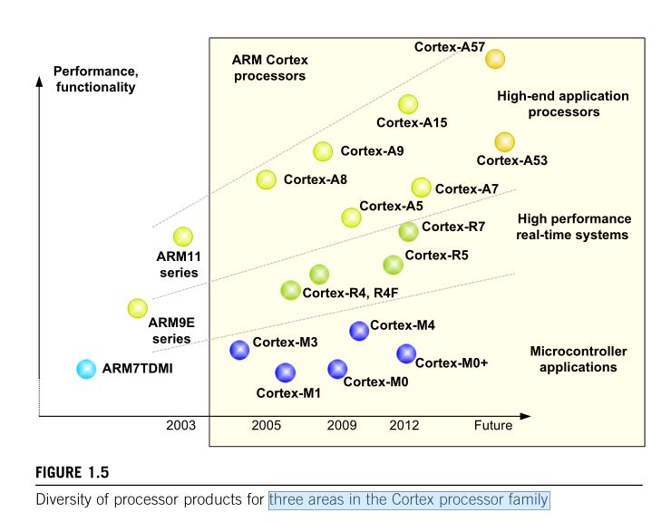
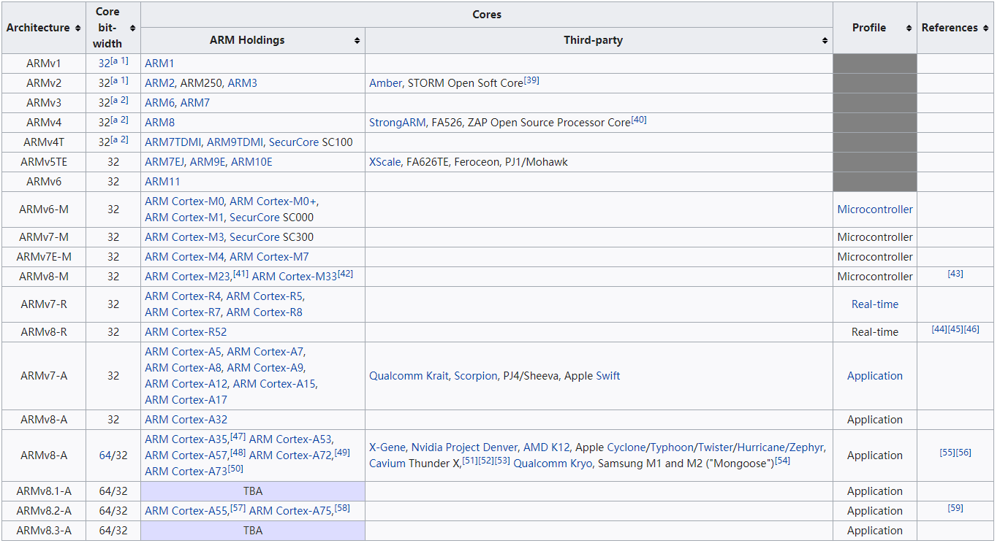
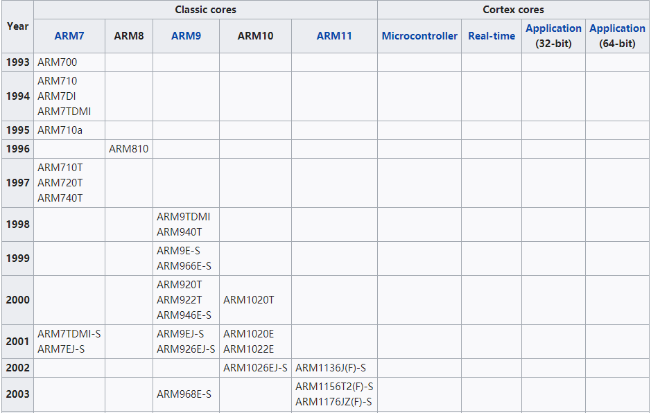
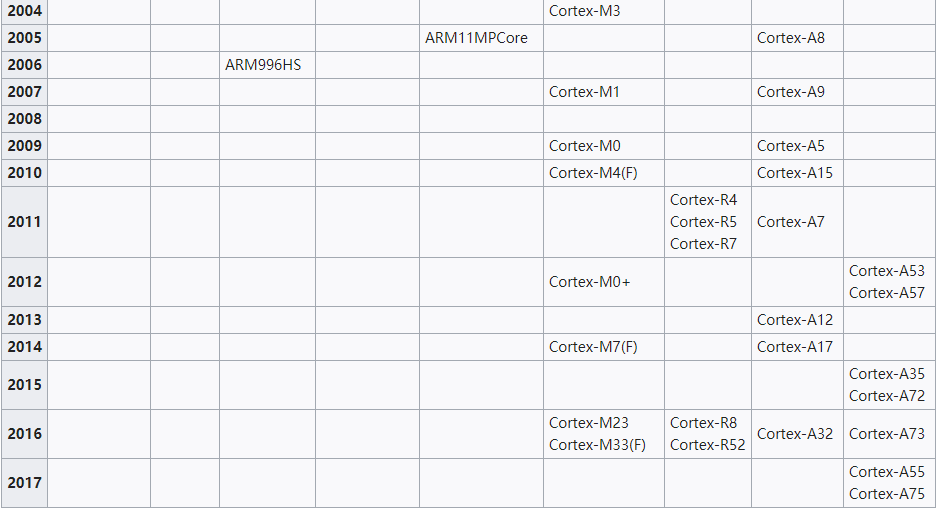

# 一、ARM介绍
ARM在1990年成立，当初的名字是“Advanced RISC Machines Ltd.,”

# 二、Cortex处理器家族三大方向发展进程

</dev>
# 三、ARM处理器与架构对应表

</dev>

# 四、ARM核对应的时间表 

</dev>

</dev>

> 本文摘自 https://blog.csdn.net/qq_38880380/article/details/79486016