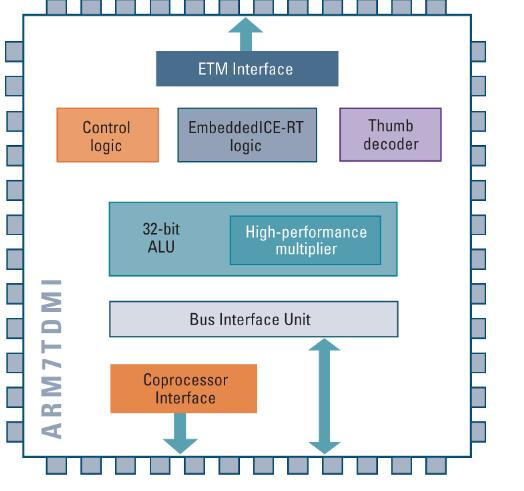
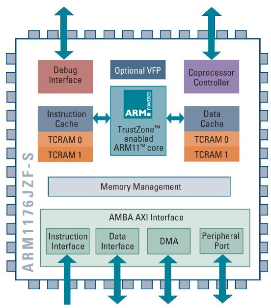
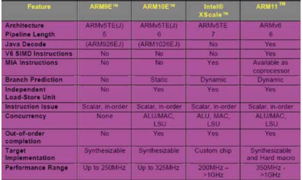

ARM处理器是英国Acorn有限公司设计的低功耗成本的第一款RISC微处理器。全称为Advanced RISC Machine。ARM处理器本身是32位设计，但也配备16位指令集，一般来讲比等价32位代码节省达35%空间，却能保留32位系统的所有优势。本文主要详解ARM7、ARM9和ARM11的区别，具体的跟随小编一起来了解一下。
# ARM7_ARM9和ARM11的区别

## 1、时钟频率的提高

　　虽然内核架构相同，但ARM7处理器采用3级流水线的冯·诺伊曼结构;而ARM9采用5级流水线的哈佛结构，ARM11为8级流水线哈弗结构（从arm9开始都采用了哈弗结构）。增加的流水线设计提高了时钟频率和并行处理能力。5级流水线能够将每一个指令处理分配到5个时钟周期内，在每一个时钟周期内同时有5个指令在执行。在常用的芯片生产工艺 下，ARM7一般运行在100MHz左右，而ARM9则至少在200MHz以上.ARM11首先推出350M~500MHz时钟频率的内核， 目前上升到1GHz时钟频率。

## 2、指令周期的改进

　　指令周期的改进对于处理器性能的提高有很大的帮助。性能提高的幅度依赖于代码执行时指令的重叠，这实际上是程序本身的问题。对于采用最高级的语言，一般来说，性能的提高在30％左右。

## 3、MMU（内存管理单元）

　　ARM7一般没有MMU（内存管理单元），（ARM720T有MMU）。

　　ARM9一般是有MMU的，ARM9940T只有MPU，不是一个完整的MMU。

　　ARM11当然也有MMU的。

　　这一条很重要，MMU单元是大型操作系统必需的硬件支持，如LINUX;WINCE等。这就是说，ARM7一般只能运行小型的实时系统如UCOS-II，eCOS等，而ARM9无此限制，一般的操作系统都可以移植。其实即使ARM720T能支持LINUX;WINCE等系统，也鲜有人用，因为以ARM7的运行速度跑这种大型操作系统，实在有点吃力。再者两者的应用领域明显不同，也无此必要。

　　下面两个图：架构一目了然

ARM7TDMI

ARM11

## 4、向后兼容性
在从ARM7到ARM9，ARM11的平台转变过程中，有一件事情是非常值得庆幸的，即ARM9，ARM11能够地向后兼容ARM7上的软件；并且开发人员面对的编程模型和架构基础也保持一致。

下面图是一些特征比较：

向后兼容性

### ARM7简介

　　ARM7系列包括ARM7TDMI、ARM7TDMI-S、带有高速缓存处理器宏单元的ARM720T。该系列处理器提供Thumb 16位压缩指令集和EmbededICE软件调试方式，适用于更大规模的SoC设计中。ARM7TDMI基于ARM体系结构V4版本，是目前低端的ARM核。

#### ARM7处理器特点：

　　ARM7内核是0.9MIPS/MHz的三级流水线和冯·诺伊曼结构，能够将每一个指令处理分配到3个时钟周期内，在每一个时钟周期内同时有3个指令在执行。

#### 互锁技术：

　　当指令需要的数据因为以前的指令没有执行完而没有准备好就会产生管道自锁互锁。当管道互锁发生时，硬件会停止这个指令的执行，直到数据准备好为止。虽然这种技术会增加代码执行时间，但是为初期的设计者提供了巨大的方便。编译器以及汇编程序员可以通过重新设计代码的顺序或者其他方法来减少管道互锁的数量。

#### CPU内核：

　　小型、快速、低能耗、集成式RISC内核，用于移动通信。

#### 体系扩展：

　　以16位系统的成本，提供32位RISC性能，特别注意的是它所需的内存容量非常小。

#### 嵌入式ICE调试：
　　由于集成了类似于ICE的CPU内核调试技术，所以原型设计和系统芯片的调试得到了极大的简化。

### ARM9简介

　　ARM9系列处理器是英国ARM公司设计的主流嵌入式处理器，主要包括ARM9TDMI和ARM9E-S等系列。

　　ARM9采用哈佛体系结构，指令和数据分属不同的总线，可以并行处理。在流水线上，ARM7是三级流水线，ARM9是五级流水线。由于结构不同，ARM7的执行效率低于ARM9。平时所说的ARM7、ARM9实际上指的是ARM7TDMI、ARM9TDMI软核，这种处理器软核并不带有MMU和cache，不能够运行诸如linux这样的嵌入式操作系统。而ARM公司对这种架构进行了扩展，所以有了ARM710T、ARM720T、ARM920T、ARM922T等带有MMU和cache的处理器内核。

#### ARM9优势

##### 1）时钟频率的提高

　　虽然ARM7和ARM9内核架构相同，但ARM7处理器采用3级流水线的冯·诺伊曼结构;，而ARM9采用5级流水线的哈佛结构。增加的流水线设计提高了时钟频率和并行处理能力。5级流水线能够将每一个指令处理分配到5个时钟周期内，在每一个时钟周期内同时有5个指令在执行。在常用的芯片生产工艺下，ARM7一般运行在100MHz左右，而ARM9则至少在200MHz以上。

##### 2）指令周期的改进

　　指令周期的改进对于处理器性能的提高有很大的帮助。性能提高的幅度依赖于代码执行时指令的重叠，这实际上是程序本身的问题。对于采用最高级的语言，一般来说，性能的提高在30%左右。

##### 3）MMU（内存管理单元）

　　ARM7一般没有MMU（内存管理单元），（ARM720T有MMU）。

　　ARM9一般是有MMU的，ARM9940T只有MPU ，不是一个完整的MMU。

### ARM11简介

　　ARM11系列微处理器是ARM公司近年推出的新一代RISC处理器，它是ARM新指令架构——ARMv6的第一代设计实现。该系列主要有ARM1136J，ARM1156T2和ARM1176JZ三个内核型号，分别针对不同应用领域。

#### ARM11体系结构

　　实现新一代微处理器的第一步就是订立一个新的结构体系。这里所说的结构体系只是对处理器行为进行描述，并不包括具体地指定处理器是如何被建造的。结构体系的定义提供了处理器和外界（操作系统，应用程序和调试支持）的接口，从细节上说，处理器结构体系定义了指令集、编程模式和最近的存储器之间的接口。最新的ARM处理器架构—ARMv6，发布于2001年10月，它建立于过去十年ARM许多成功的结构体系基础上。同处理器的授权相似，ARM也向客户授权它的结构体系。比如，以前Intel的XScale就是基于ARMv5TE的处理器。

#### ARM11处理器的内核特点

　　ARM11处理器是为了有效的提供高性能处理能力而设计的。在这里需要强调的是，ARM并不是不能设计出运行在更高频率的处理器，而是，在处理器能提供超高性能的同时，还要保证功耗、面积的有效性。ARM11优秀的流水线设计是这些功能的重要保证。

#### ARM11目标应用

　　ARMv6架构是根据下一代的消费类电子、无线设备、网络应用和汽车电子产品等需求而制定的。ARM11的媒体处理能力和低功耗特点，特别适用于无线和消费类电子产品；其高数据吞吐量和高性能的结合非常适合网络处理应用；另外，也在实时性能和浮点处理等方面ARM11可以满足汽车电子应用的需求。可以预言，基于ARMv6体系结构的ARM11系列处理器将在上述领域发挥巨大的作用。

> 摘抄自 http://m.elecfans.com/article/678315.html