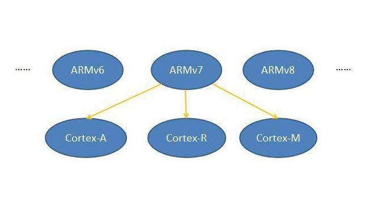
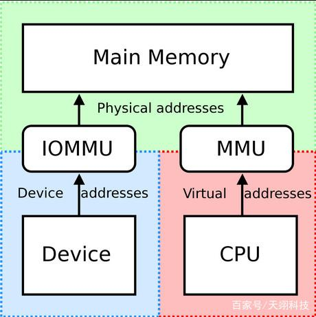
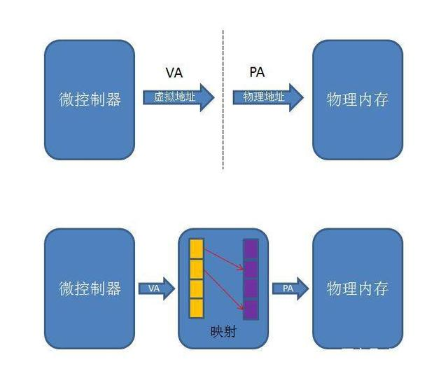
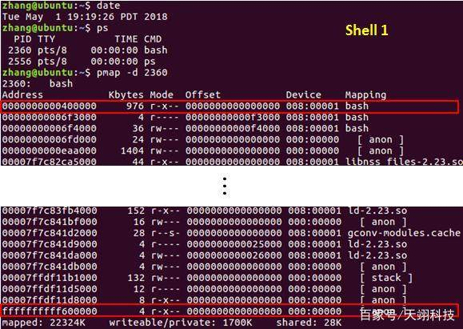
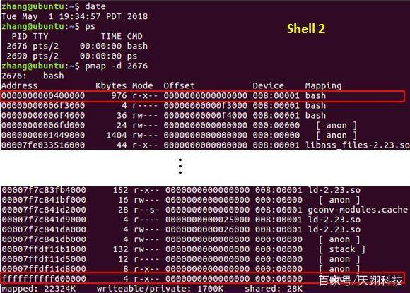
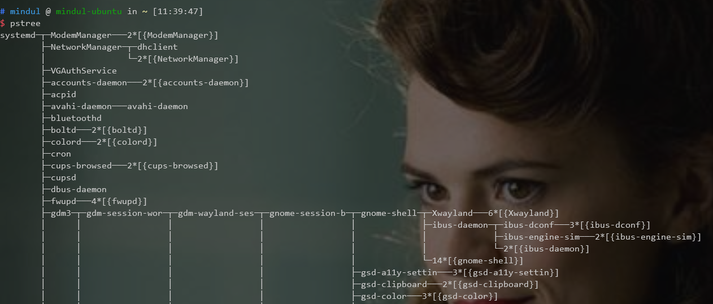

单片机与应用处理器的核心区别到底是什么呢？是核心主频的差异？还是Linux系统的支持？又或者是处理器的架构？本文将以NXP的Cortex-M系列为例做简要介绍。


一、Cortex-M的定位

处理器的体系结构定义了指令集(ISA)和基于这一体系结构下处理器的程序员模型，通俗来讲就是相同的ARM体系结构下的应用软件是兼容的。从ARMv1到ARMv8，每一次体系结构的修改都会添加实用技术。

在ARMv7版本中，内核架构首次从单一款式变成3种款式。Cortex-M系列属于ARMv7结构下的一个款式:款式M。款式M包含的处理器有Cortex-M0、Cortex-M1、Cortex-M3、Cortex-M4以及Cortex-M7，以上处理器常被用于低成本、低功耗、高可靠的嵌入式实时系统中。它们既可以用于"裸片"开发又能运行实时操作系统，比如us/os-ll、VxWorks以及Aworks(致远电子开发)等。

<div align=center>

</div>
<center>图1 ARMv7下的Cortex系列</center>

1. 款式A:高性能的处理器级平台，性能比肩计算机。

2. 款式R:定位应用于高端嵌入式系统，高可靠及高时效性。

3. 款式M:用于深度嵌入、定制的嵌入式系统。

值得注意的是，Cortex-M下的处理器没有内存管理单元MMU。

二、内存管理单元MMU

内存管理单元简称MMU，它负责虚拟地址到物理地址的映射，并提供硬件机制的内存访问权限检查。在多用户、多进程的操作系统中，MMU使得各个用户进程都有独立的地址空间。


<div align=center>

</div>
<center>图2 MMU的地位</center>

任何微控制器都存在一个程序能够产生的地址集和，被称为虚拟地址范围。以32为机为例，虚拟地址范围为```0~0xFFFFFFFF``` (4G)。当该控制器寻址一个256M的内存时，它的可用地址范围被限定为```0x00000000~0x0FFFFFFF```(256M)。在没有MMU的控制器中，虚拟地址被直接发送到内存总线上，以读写该地址下的物理存储器。在拥有MMU的控制器中，虚拟地址首先被发送到MMU中，被映射为物理地址后再发送到内存总线上。


<div align=center>

</div>

<center>图3 内存管理机制</center>

注:上图仅简单反映内存管理的映射机制，权限映射、TLB快表、页表等概念不做深入讨论。

虚拟内存管理最主要的作用是让每个进程有独立的地址空间。不同进程中的同一个虚拟地址被MMU映射到不同的物理地址，并且在某一个进程中访问任何地址都不可能访问到另外一个进程的数据，这样使得任何一个进程由于执行错误指令或恶意代码导致的非法内存访问都不会意外改写其它进程的数据，不会影响其它进程的运行，从而保证整个系统的稳定性。另一方面，每个进程都认为自己独占整个虚拟地址空间，这样链接器和加载器的实现会比较容易，不必考虑各进程的地址范围是否冲突。

三、linux系统

一般将操作系统分为实时操作系统和非实时操作系统。实时操作系统大多为单进程、多线程(多任务)，因此不涉及到线程间的地址空间分配，不需要使用MMU，例如VxWorks。Linux系统属于非实时性操作体统，多进程是其主要特点。

以Ubuntu为例，打开一个shell并且查看bash进程的地址范围如图4，它的地址范围为```0x0000000000400000~0xffffffffff600000```。


<div align=center>

</div>

<center>图4 shell 1中的bash地址</center>

我们打开另一个shell，查看该shell中bash进程的地址范围，如图5。不难发现，两个不同bash进程的地址范围完全相同。其实操作系统或者用户在fork()进程时完全不需要考虑物理内存的地址分配，该工作由微控制器的内存管理单元MMU来做。

<div align=center>

</div>

<center>图5 shell 2中的bash地址</center>

既然是多进程依赖了内存管理单元，那么在使用嵌入式linux时只开一个进程可以吗?肯定是不可行的!开机后即使用户什么都不做，可见的系统运行必须的进程已经运行了几十至上百个，如图6。

<div align=center>

</div>
<center>图6 进程树</center>

四、总结

综合以上内容，linux系统对内存管理单元MMU有极强的依赖，若在没有MMU的处理器中运行linux，恐怕整个系统只能停留在Uboot阶段了。由于Cortex-m处理器没有内存管理单元，因此跑不了linux系统。任何事情都不是绝对的，如果你重写了linux内核且搭配足够大的内存芯片，从理论上来说是可以省掉MMU的。但是，这样的工作量，真的值得吗?实际上，MMU就是为了解决操作系统越来越复杂的内存管理而产生的。

五、拓展部分

很大一部分开发者选用嵌入式linux系统未能发挥出它的优势，仅仅是为了获得开发上的便利，比如以太网、4G上云、LCD驱动、文件系统、图像识别、python应用等等。那么有没有方法既能使用传统高实时性、低成本的单片机又不用面对繁琐的硬件驱动开发呢?广州致远电子有限公司推出的全新AWorks平台--IoT物联网生态系统正是为此而生。

AWorks的诞生极大的降低了开发者门槛，为开发者提供便利，使开发者可以忽略底层技术细节，专注产品"核心域"，更快的开发出具有竞争力的产品。同时，AWorks为开发者提供的是高度抽象的通用接口，基于AWorks平台的软件与底层硬件无关，可以"随心所欲"的跨平台复用(如更换MCU等等)。跨界硬件搭载AWoeks IoT实时操作系统，让您的开发更容易，功能更强大。

> 摘抄自 http://www.eepw.com.cn/article/201805/380385.htm