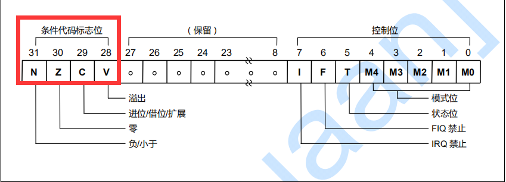
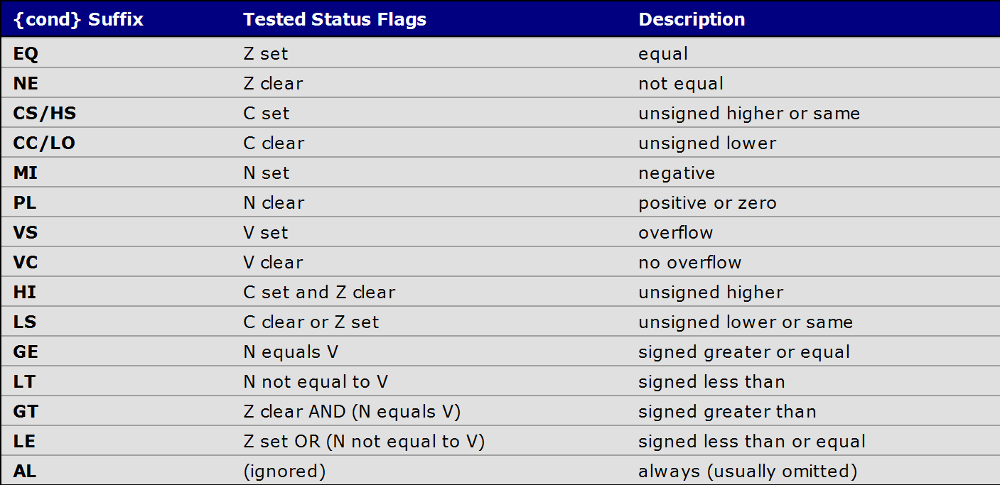

# 条件执行之执行条件

大多数ARM指令的指令格式包含一个```{cond}```字段。这意味着这条指令只能在满足由```{cond}```字段所表示的条件时再执行。

ARM处理器上使用程序状态字寄存器PSR的条件代码标志位来判断当前条件是否满足。如下是条件代码标志位

<div align="center">

</div>

如下是判断方式
<div align="center">

</div>

