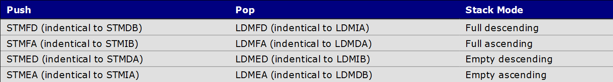

# ldm和stm

```ldm```和```stm```是分别用来读写内存的汇编指令。

读写内存主要分为两种情况：
1. 寄存器与内存之间批量数据复制（包含单个寄存器的情况）
2. 寄存器入栈和出栈
   
## 1. 寄存器和内存批量复制
两个要素：
1. 依次存储多个单元时，基地址寄存器中地址是**递增**还是**递减**
2. **先改变地址再存储** 还是 **先存储再改变地址**

我们将这两种要素的共四种情况列表如下：

<div align="center">

</div>

进而指令一共有8种，分别是

-|存储指令 | 读取指令
-|-|-
1|STMIA|LDMIA
2|STMIB|LDMIB
3|STMDA|LDMDA
4|STMDB|LDMDB

## 2. 入栈和出栈时的批量复制
入栈和出栈本质上也是寄存器和内存之间数据的批量复制。不过，貌似ARM指令集设计时，特意将栈操作拿出来，分成两种情况
1. 栈的生长方向向上或是向下
> Descending (high to low address) or ascending (low to high address)
2. 栈头指针所指空间是否为空
> Full(last item in the stack is pointed)or Empty(next free space in the stack is pointed) stack.

进而栈操作指令一共有8种，分别是

-|存储指令 | 读取指令
-|-|-
1|STMFD|LDMFD
2|STMFA|LDMFA
3|STMED|LDMED
4|STMEA|LDMEA

而要知道，入栈出栈操作只是寄存器批量复制到栈的一种特殊情况。我们可以找到上述16条指令之间的相等关系：
<div align=center>

</div>


## 3. 指令的使用
### a.指令格式

>LDM{[cond](./_cond.md)}mode Rn{!}, reglist{^}
>
>STM{[cond](./_cond.md)}mode Rn{!}, reglist{^}

>cond: 在当前目录下的_cond.md文件中有所描述。
>
>Rn: 表示基地址寄存器
>
>{!}: 如果加上“!”表示在操作结束后，要更新Rn的值。否则不更新。
>
>reglist: 表示当前需要用到的寄存器列表
>
>{^}: 
>>如果当前为arm的用户模式，则忽略
>>
>>如果当前为arm的特权模式
>>>ldm表示将SPSR_mode中的内容复制到CPSR中，这通常伴随着PC地址的改变（恢复为栈中保存的LR的值）
>>>
>>>stm目前暂不考虑，因为我还没看懂（mmp）

下面是一个IRQ中断服务程序：
```arm
HandleIRQ:
    sub lr, lr, #4                  @ 计算返回地址
    stmdb   sp!,    { r0-r12,lr }   @ 保存使用到的寄存器
                                    @ 注意，此时的sp是中断模式的sp
                                    @ 初始值是上面设置的4096
    
    ldr lr, =int_return             @ 设置调用IRQ_Handle函数后的返回地址  
    ldr pc, =IRQ_Handle             @ 调用中断分发函数，在interrupt.c中
int_return:
    ldmia   sp!,    { r0-r12,pc }^  @ 中断返回, ^表示将spsr的值复制到cpsr
```  
在ldmia指令最后有一个“^”，这表示将spsr_irq放到cpsr中。

### b.保存与恢复
现在我们来看看，datacopy.s中关于数据批量复制的部分
```arm
	stmfd sp!, {r4-r11}
trans8reg
	ldmia r0!, {r4-r11}
	stmia r1!, {r4-r11}
	subs r3, r3, #1
	bne trans8reg
	ldmfd sp!, {r4-r11}
```
1. 使用stmfd指令，将r4-r11中的内容保存（入栈）到栈中
2. 使用ldmia指令从r0所指定的地址处读出8字数据存放到r4-r11
3. 使用stmia指令将r4-r11中的数据存放到从r1所指定地址处开始的8字中
4. 使用ldmfd指令将栈中内容读出（出栈）存放到r4-r11

我们使用一种指令入栈，应该有一个对应的指令出栈可以让数据还原。

入栈指令 | 出栈指令
:-:|:-:
stmfd | ldmfd
stmfa | ldmfa
stmed | ldmed
stmea | ldmea

这个很简单。而数据批量复制的指令则是依据你的需求来使用就好了。


