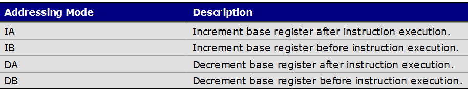

# ldm和stm

```ldm```和```stm```是分别用来读写内存的汇编指令。

读写内存主要分为两种情况：
1. 寄存器与内存之间批量数据复制（包含单个寄存器的情况）
2. 寄存器入栈和出栈
   
## 1. 寄存器和内存批量复制
两个要素：
1. 依次存储多个单元时，基地址寄存器中地址是**递增**还是**递减**
2. **先改变地址再存储** 还是 **先存储再改变地址**

我们将这两种情况的共四种选择列表如下：

<div align="center">

</div>

进而指令一共有8种，分别是
-|存储指令 | 读取指令
-|-|-
1|STMIA|LDMIA
2|STMIB|LDMIB
3|STMDA|LDMDA
4|STMDB|LDMDB

## 2. 入栈和出栈时的批量复制
入栈和出栈本质上也是寄存器和内存之间数据的批量复制。不过，貌似ARM指令集设计时，特意将栈操作拿出来了，更加方便我们记忆和使用。


   
